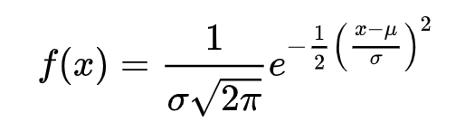
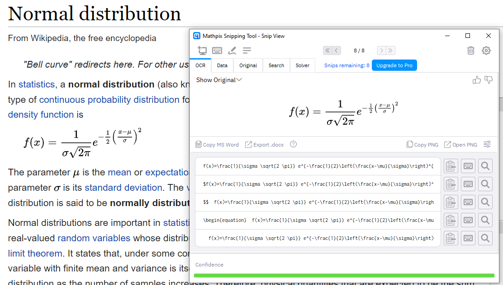

```{r setup, include=FALSE, message = FALSE, warning=FALSE}

options(htmltools.dir.version = FALSE)

```


## Workshop

This workshop consists of three parts:

1. Introduction to $\LaTeX{}$
1. Introduction to `R Markdown`
2. Writing scientific articles with the [`papaja`](https://github.com/crsh/papaja) package


<!-- *********** NEW SLIDE ************** -->
---
## Learning Goals

At the end of this mini-workshop, you should ... :

- ... know how to write documents in $\LaTeX{}$

- ... know what `RMarkdown` is and how it works

- ... know how to integrate code and data with `RMarkdown`

- ... be able to write APA conform manuscripts with the `papaja`-package


<!-- *********** HEADING ************** -->
---
class: heading,middle


Part 1: Introduction to $\LaTeX{}$


<!-- *********** NEW SLIDE ************** -->
---
## What is $\LaTeX{}$?

- $\LaTeX{}$ (pronounced LAY-tek or LAH-tek) is a tool used to create professional-looking (scientific) documents.

- Developed by Leslie Lamport in the 1980s as a user-friendly version of $\TeX{}$ ($\TeX{}$ was developed by [Donald E. Knuth](https://de.wikipedia.org/wiki/Donald_E._Knuth)) 

- $\LaTeX{}$ = Lamport TeX 

- Produces the resulting document on all computers and operating systems
  
- Separates the tasks of *writing* Text  from *formatting* it
  - Word is *WYSIWYG*: "what you see is what you get"
  - $\LaTeX{}$ is *WYSIWYM*: "what you see is what you mean"
  
  
  
<!-- *********** NEW SLIDE ************** -->
---
## Why use $\LaTeX{}$ in the first place?  

$\LaTeX{}$ ...

- is used all over the world for scientific documents, books, as well as many other forms of publishing.

- can easily create well-formatted reproducible documents including equations, tables, figures, footnotes, and references

- Large number of packages add a lot if possibilities 

- Easy to change the layout and formatting according to different (journal) templates

- can write books, generate presentations, posters, a professional looking CV, letters,  and much more

- is more fun then word

<!-- *********** NEW SLIDE ************** -->
---
## How to use $\LaTeX{}$

To use $\LaTeX{}$ you usually need:

- $\TeX{}$ distribution, e.g., [MiKTeX](https://miktex.org/), [MacTeX](https://tug.org/mactex/), [TinyTeX](https://yihui.org/tinytex/) (the best in combination with R)

- and an editor, e.g., [TeXMaker](https://www.xm1math.net/texmaker/), [TeXWorks](https://tug.org/texworks/), [Atom](https://atom.io/), [Visual Studio Code](https://code.visualstudio.com/)


or [Overleaf](https://www.overleaf.com/):

> Overleaf is an online collaborative writing and publishing tool that makes the whole process of writing, editing and publishing scientific documents much quicker and easier. Overleaf provides the convenience of an easy-to-use LaTeX editor with real-time collaboration and the fully compiled output produced automatically in the background as you type.


<!-- *********** NEW SLIDE ************** -->
---
## Your turn - Getting Started 

Create a blank project in Overleaf

.center[

]


<!-- *********** NEW SLIDE ************** -->
---
## Overleaf

.center[

]


<!-- *********** NEW SLIDE ************** -->
---
## $\LaTeX{}$ Documents

Every $\LaTeX{}$ document consists of two parts, a **preamble** and the **body**

.pull-left[

**Preamble** defines the generall settings (e.g., general layout, document type, font, packages, author info)

```{tex, eval = FALSE}
\documentclass{article}
\usepackage[utf8]{inputenc}

\title{SMiP Workshop}
\author{David Izydorczyk}
\date{June 2022}
```


]


.pull-right[

**Body** is where you enter your main text. It is nested inside the document environment via: `\begin{document}` and `\end{document}`<sup>1</sup> :

```{tex, eval = FALSE}
\begin{document}

\maketitle

\section{Introduction}

This is some text. Wow.

\end{document}
```


]


.footnote[<sup>1</sup> Where goes waht? Rule of thumb: Everything between `\begin{document}` and `\end{document}` is shown in the document, everything outside not]


<!-- *********** NEW SLIDE ************** -->
---
##  `\documentclass`

`\documentclass` defines the type of document and the general layout. The syntax is:

```{tex, eval = FALSE}
\documentclass[options]{class}
```

**`classes`**: There are many different classes available. The most common/important are:

- `article`
- `journal`
- `book`
- `beamer`, for presentations
- `apa7` (we talk about this later)

But most journals offer their own specific document classes, e.g. [PNAS](https://de.overleaf.com/latex/templates/template-for-preparing-your-research-report-submission-to-pnas-using-overleaf/fzcbzjvpvnxn).

**`options`**: Allows to customize the behavior of the document class, e.g.:

- **font size**: `10pt`, `11pt`, `12pt`
- **paper size**: `a4paper`, etc
- **columns**: `onecolumn, twocolumn`


To add multiple options: `[12pt,a4paper,twocolumn]`

<!-- *********** NEW SLIDE ************** -->
---
##  Packages

Packages can be loaded with the  `\usepackage` command. As `\documentclass`, we define the package and additional options via:

```{tex, eval = FALSE}
\usepackage[options]{package}
```


Some must have/useful packages are: 

- **`[T1]{fontenc}`**: to have ö and stuff
- **`graphicx`**: To include 
- **`booktabs`**: for better looking tables
- **`tikz`**:  to creating vector graphics programmatically
- **`amsmath`**: extends the default math related capabilities of LaTeX
- **`amssymb`**: adds additional symbols and fonts for formulas.
- **`[style=apa]{biblatex}`**: for citations
- **`hyperref`**: makes contents, references, URLs and citation all become clickable in the resulting PDF
- **`caption`**: for figure and table captions
- **setspace**: to change spacing between lines (`\doublespacing`, `\onehalfspacing`)

<!-- *********** NEW SLIDE ************** -->
---
##  Comments

.pull-left[


When there is syntax there shall be comments !

```{tex, eval = FALSE}
% this is a comment in LaTeX
```


]


.pull-right[


]

<!-- *********** NEW SLIDE ************** -->
---
##  Additional useful stuff in the preamble:

Author and Article Informations:

- `\title{Das ist ein Titel}`
- `\shorttitle{Kurztitel}`
- `\author{Manuela Musterman}`
- `\affiliation{Universität Mannheim}`

When using `apa7` class:

- `\abstract{Hier kommt der Abstract rein.}`
- `\keywords{APA style, demonstration}`


Other things:

- `\graphicspath{{figures/}}`: Default path of figures 
- `\newcommand{\x}{\boldsymbol{x}}`: Define custom commands 


<!-- *********** NEW SLIDE ************** -->
---
##  Headers - Structuring your document:

You can structure your document with:

.pull-left[

```{tex, eval = FALSE}
\section{Introduction}
\subsection{Working Memory}
\subsubsection{Visual Working Memory}
\paragraph{Oberauer (2020)}
\subparagraph{Experiment 1}
```

]


.pull-right[


]


<!-- *********** NEW SLIDE ************** -->
---
##  Your turn!

- Create the outline of a general scientific article using the different header options

- fill in some text (you can copy this one: Lorem ipsum dolor sit amet, consetetur sadipscing elitr, sed diam nonumy eirmod tempor invidunt ut labore et dolore magna aliquyam erat, sed diam voluptua. At vero eos et accusam et justo duo dolores et ea rebum. Stet clita kasd gubergren, no sea takimata sanctus est Lorem ipsum dolor sit amet.)

- play around with some of the document classes and class options.

- Adjust the title, author name etc.

<!-- *********** NEW SLIDE ************** -->
---
## Text formatting

.pull-left[

```{tex, eval = FALSE}
This is \textbf{some bold text} 

This is \textit{italic text}

This is \underline{very important}

Look at \textcolor{blue}{this}

```

]


.pull-right[


]

<!-- *********** NEW SLIDE ************** -->
---
## Sizing

.pull-left[

```{tex, eval = FALSE}
This is normal text 

 \LARGE{ This is LARGE text}

 \Large{ This is Large text}

 \large{ This is large text}

 \small{ This is small text}

 \footnotesize{ This is footnote-size text}

 \tiny{This is tiny text}

```

]


.pull-right[


]

<!-- *********** NEW SLIDE ************** -->
---
## Alignment


```{tex, eval = FALSE}
\begin{center} Center aligned \end{center}

\begin{flushright} right aligned text \end{flushright}

\begin{flushleft} left aligned text \end{flushleft}
```


<!-- *********** NEW SLIDE ************** -->
---
## Line breaks 

Line breaks in $\LaTeX{}$ work a little bit different than in Word. If you only hit `Enter` once, there will be no linebreak in the PDF, but *only* in your editor. 

To insert a linebreak, you can either hit `Enter` twice, use `\\`, or `\newline`. 

To add more space you can use  `\vspace{2cm}`


<!-- *********** NEW SLIDE ************** -->
---
## Unordered lists 

.pull-left[

```{tex, eval = FALSE}
\begin{itemize}
  \item Tomatoes
  \item Coffee
\end{itemize}
```

]


.pull-right[


]


<!-- *********** NEW SLIDE ************** -->
---
## Ordered lists 

.pull-left[

```{tex, eval = FALSE}
\begin{enumerate}
  \item Dogs
  \item Cats
\end{enumerate}
```

]


.pull-right[


]


<!-- *********** NEW SLIDE ************** -->
---
## Footnotes

.pull-left[

```{tex, eval = FALSE}
Lorem ipsum dolor sit amet 
\footnote{However, this is a footnote}
```

]


.pull-right[


]


<!-- *********** NEW SLIDE ************** -->
---
##  Your turn!

- Apply some of the text formattings to your text

- Insert some linebreaks

- Add a list

- Add two footnotes


<!-- *********** NEW SLIDE ************** -->
---
##  Equations

.pull-left[

- Equations are the main selling point of $\LaTeX{}$

- [Here](https://www.caam.rice.edu/~heinken/latex/symbols.pdf) you can find a basic overview of available symbols and how to write equations. We will cover only the most important things.

- There are two main ways to include equations and mathematical symbols: **inline** or **standalone**

]


.pull-right[


]

<!-- *********** NEW SLIDE ************** -->
---
##  Inline Equations


.pull-left[

 You can write inline equations (i.e. in the normal lines of text) by activating the math mode:
 
.center[`$ ... $`]
 
]


.pull-right[


]


---
class: small
##  Inline Equations


Examples:

.pull-left[

 ```{tex, eval = FALSE}
explained variance was $R^{2} = 0.96$


MCMC chains converged with $\hat{R} \leq 1.01$


With 32 stimuli there are $\frac{32 \times (32-1)}{2} = 496$ pairwise similarity ratings


The memory parameter $\theta$ had a Beta(1,1) prior. 


The posterior probability of Model 1 was $p(\mathcal{M}_1|D) = .5$
```
 
]


.pull-right[


]


<!-- *********** NEW SLIDE ************** -->
---
##  Standalone Equations

To write standalone equations you can use the `equation` environment (or `equation*` for unnumbered equations from the `amsmath` package). Example:

.pull-left[

 ```{tex, eval = FALSE}
\begin{equation} 
d_{pe} = \sqrt{\sum_{k = 1}^{n_k} (p_k - e_k)^2 }
\end{equation}


\begin{equation*} 
s_{pe} = e^{-cd_{pe}}
\end{equation*}

```
 
]


.pull-right[


]

<!-- *********** NEW SLIDE ************** -->
---
##  Aligned Equations

To align equations on `=` we need to use the `align` environment from the `amsmath` package


.pull-left[

 ```{tex, eval = FALSE}
\begin{align

Y_i &= b_0 + b_1 \times X_i \\

b_0 &\sim Normal(0,10) \\

b_1 &\sim Normal(0,1) 

\end{align}

```
 
]


.pull-right[


]

<!-- *********** NEW SLIDE ************** -->
---
##  Your turn

Implement all three equations shown below (tip: check out `\overbrace{}_\text{}`)


.pull-left[


<br>
<br>




]


.pull-right[


]

<!-- *********** NEW SLIDE ************** -->
---
##  Mathpix Snipping Tool:




---
##  Figures

We can add figures using the `figure` environment and the `\includegraphics{}` function. Overleaf automatically adds some additional stuff when we create the `figure` environment, e.g., it centers the image (`\centering`), adds a caption below the figure (`\caption`), and a label (`\label`, we talk about that later). 

We also need to load `\usepackage{graphicx}`

.pull-left[

 ```{tex, eval = FALSE}
\begin{figure}

    \centering
    
    \includegraphics[scale = 0.75]{plot1.png}
    
    \caption{Caption}
    
    \label{fig:my_label}
    
\end{figure}

```
 
]


.pull-right[


]


<!-- *********** NEW SLIDE ************** -->
---
##  Your turn

Upload and add two figures to your document.


<!-- *********** NEW SLIDE ************** -->
---
##  Lets talk about floats

- floating objects can be annoying

- Figures and tables float within the text: $\LaTeX{}$ puts them in the best-fitting spot itself (which doesn't has to be the place where it is in your editor)

- Most of the times this works, if not, you can use the placement specifier options `\begin{figure}[htpb!]`. From overleaf:

| Specifier | Permission                                                                                                                                                                                                                       |
|-----------|----------------------------------------------------------------------------------------------------------------------------------------------------------------------------------------------------------------------------------|
| h         | Place the float here, i.e., approximately at the same point it occurs in the source text (however, not exactly at the spot)                                                                                                      |
| t         | Position at the top of the page.                                                                                                                                                                                                 |
| b         | Position at the bottom of the page.                                                                                                                                                                                              |
| p         | Put on a special page for floats only.                                                                                                                                                                                           |
| !         | Override internal parameters LATEX uses for determining "good" float positions.                                                                                                                                                  |
| H         | Places the float at precisely the location in the LATEX code. Requires the float package (\usepackage{float}). This is somewhat equivalent to h!, though some errors may arise if you have too many consecutive floats with [H]. |


(I mostly just use [H])

<!-- *********** NEW SLIDE ************** -->
---
##  Tables

Tables in $\LaTeX{}$ can be very hard. But lets have a look. The general syntax is the same as for figures:


 ```{tex, eval = FALSE}
\begin{table}

    \centering
    \caption{Caption}
    
    ...
    
    
    \label{fig:my_label}
    
\end{table}

```


<!-- *********** NEW SLIDE ************** -->
---
##  Tables

However, instead of just including a figure with `\includegraphics{}`, we have to built our table within the `tabular` environment (but wait for Part 3 today!).

The basics: 
- `\\` for row
- `&` for column
- different lines (`\toprule, \midrule, \bottomrule`) from the `booktabs` package
- `\begin{tabular}{ccc}`: **c**enter alignment of all three columns (`l`for left, `r` for right)

.pull-left[

 ```{tex, eval = FALSE}
   
\begin{tabular}{ccc}
    \toprule
    
    Exp & $M$ & $SD$ \\
    
    \midrule
    
    Exp. 1 & 16.10 & 3.37\\
    Exp. 2 & 24.53  & 5.24\\
    Exp. 3 & 21.38  & 6.65\\
    
    \bottomrule
\end{tabular}

```
 
]


.pull-right[


]


<!-- *********** NEW SLIDE ************** -->
---
##  Tables

Tables can also be more complicated:

.pull-left[

 ```{tex, eval = FALSE}
\toprule
   
Exp. & \multicolumn{3}{c}{Parameters} \\
    
& Drift rate ($\delta$) &
Starting bias ($z$) &
Non-decision time ($\tau$) \\
    
\midrule
    
1 & 0.50 & .67 & 5 \\
2 & 0.54 & .32 & 2 \\
3 & 0.74 & .01 & 4 \\
    
\bottomrule

```
 
]


.pull-right[


]

<!-- *********** NEW SLIDE ************** -->
---
class:small
##  Table Notes

We can add table notes with using functions from `\usepackage[flushleft]{threeparttable}`:

.pull-left[

 ```{tex, eval = FALSE}
\begin{table}[h!]

\begin{threeparttable}

...

\begin{tabular}{cccc}

...

\end{tabular}
\begin{tablenotes}[para]

\item \textit{Note.} 
\item Parameter were estimated with ....

\end{tablenotes}
\end{threeparttable}
\end{table}

```

]

.pull-right[


]

<!-- *********** NEW SLIDE ************** -->
---
##  Your turn!

Implement the following table:

.center[

]

You don't need to implement all the rows and the complete note.


<!-- *********** NEW SLIDE ************** -->
---
##  Referencing Figures and Tables in text

Lets talk about `\label`. When you label your figures and tables, 

- they get automatically numbered
- you can reference them in the text using `ref{fig:label}`/`ref{tab:label}`, so you don't have to care about the correct referencing even when you add/delete/rearrange tables or figures.

Example:


.pull-left[

 ```{tex, eval = FALSE}
\begin{figure}
    \centering
    \includegraphics[scale = 0.75]{plot1.png}
    \caption{Caption}
    \label{fig:my_label}
\end{figure}


The average mouse trajectories are
shown in Figure~\ref{fig:my_label}

```

]

.pull-right[


]

`~` prevents linebreak between Figure and 1 (not necessary in this example)


<!-- *********** NEW SLIDE ************** -->
---
##  Citations and References

Citations are another advantage of $\LaTeX{}$, since it is able to automatically generate citations and bibliographies. What we need:

- a package (`\usepackage[style=apa,sortcites=true,sorting=nyt,backend=biber]{biblatex}`, nyt = name, year, title)

- a bibliography in a `.bib` file with entries in `BibTex` format

- telling $\LaTeX{}$ where your `.bib` is with `\addbibresource{}`

- printing your references at the end of your document `\printbibliography`

<!-- *********** NEW SLIDE ************** -->
---
##  `.bib`

`BibTeX` format is just a way of defining an article’s citation information (name, authors, year, journal etc.) in a standardized way. Example:

```{r eval=FALSE}
@article{rubin1996,
  title={Multiple imputation after 18+ years},
  author={Rubin, Donald B},
  journal={Journal of the American statistical Association},
  volume={91},
  number={434},
  pages={473--489},
  year={1996},
  publisher={Taylor \& Francis Group}
}
```


- Best way to get your .bib - file is by exporting your Zotero/Citavi/etc. library,  via [Google Scholar](https://scholar.google.de/) or via [Crossref](https://search.crossref.org/).

- However, sometimes you have to edit the entries still by hand (or let some Hiwi do it)

<!-- *********** NEW SLIDE ************** -->
---
## Citing


Only citations which appear in the text, are added to the references


<!-- *********** NEW SLIDE ************** -->
---
##  Your turn !

Add the bibtex entries of your two favorite papers/books to your `.bib`-file and then cite them in your text !

You might have to Google how to add books or formats other then articles


<!-- *********** NEW SLIDE ************** -->
---
##  APA7 

You can most of your APA7 formatting done by changing your document class to: `\documentclass[man,floatsintext]{apa7}`, our you load the [template](https://de.overleaf.com/latex/templates/template-and-sample-for-authoring-apa7-manuscripts/pvhtwcrvcmsp) from Overleaf. 


You can get APA7 conform figures (captions above figure, note below it) like this:

 ```{tex, eval = FALSE}
 
 \usepackage[labelsep=newline,labelfont=bf]{caption}
 
 ...
 
\begin{figure}
\centering
\caption{\label{fig:ahExp}Results of the availability heuristic experiment.}
\includegraphics[width=1\textwidth]{plot2.png}
\caption*{\footnotesize{\textit{Note. }\textnormal{Results of the three-dimensional....}}}
\end{figure}
```

For more in formations about the `apa7` class, see [here](https://ctan.math.washington.edu/tex-archive/macros/latex/contrib/apa7/apa7.pdf)

<!-- *********** NEW SLIDE ************** -->
---
##  Your turn !

Make your document submission ready ! Try changing `man` to `jou`, `stu`, `doc`, or adding `draftall` to the document class options.

<!-- *********** NEW SLIDE ************** -->
---
##  Tikz

You can also make vector graphics in $\LaTeX{}$ (if you really want to suffer like me)


If you really want to do this, you can start 
- [here](https://www.youtube.com/watch?v=bQugbYq0BVA)
- [or here](https://de.overleaf.com/learn/latex/LaTeX_Graphics_using_TikZ%3A_A_Tutorial_for_Beginners_(Part_1)%E2%80%94Basic_Drawing)


<!-- *********** NEW SLIDE ************** -->
---
##  Working with colleagues

In summary: meh.

- You can invite colleagues to your Overleaf projects (but only one with the free plan). 

- In the premium plan there is even a [track changes feature](https://de.overleaf.com/learn/how-to/Track_Changes_in_Overleaf) similar to word (there are [student plans](https://de.overleaf.com/user/subscription/plans) available)

- Otherwise you are left with Github

- Use [`latexdiff`](https://de.overleaf.com/learn/latex/Articles/Using_Latexdiff_For_Marking_Changes_To_Tex_Documents) to compare versions of your documents

<!-- *********** NEW SLIDE ************** -->
---
## Helpful references:

- https://de.overleaf.com/learn/latex/Free_online_introduction_to_LaTeX_(part_1)
- https://web.mit.edu/rsi/www/pdfs/new-latex.pdf


